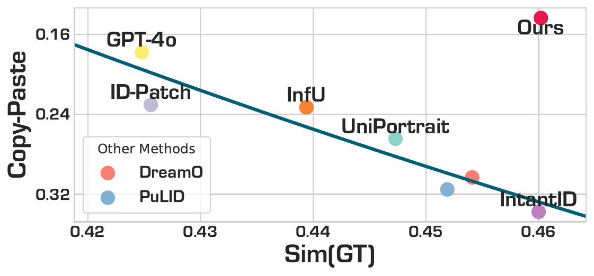

# WithAnyone: Towards Controllable and ID-Consistent Image Generation
<!-- badges -->
> [](https://arxiv.org/abs/)
[](https://doby-xu.github.io/WithAnyone/)
[](https://huggingface.co/WithAnyone/WithAnyone)
[](https://huggingface.co/datasets/WithAnyone/MultiID-Bench)
[](https://huggingface.co/datasets/WithAnyone/MultiID-2M)
[](https://huggingface.co/black-forest-labs/FLUX.1-dev/blob/main/LICENSE.md)
<!-- [](https://huggingface.co/spaces/black-forest-labs/WithAnyone) -->


Hengyuan Xu, Wei Cheng*, Peng Xing, Yixiao Fang, Shuhan Wu, Rui Wang, Xianfang Zeng, Daxin Jiang, Gang Yu✝, Xingjun Ma✝, Yu-Gang Jiang  
(* Project lead, ✝ Corresponding authors)  
Fudan University, StepFun

<!-- <p align="center">
  <a href="assets/teaser.pdf">
    
  </a>
</p> -->

<p align="center">
  <a href="assets/withanyone.gif">
    
  </a>
</p>

Star us on GitHub if you find this project useful! ⭐

## Introduction

WithAnyone is capable of generating high-quality, controllable, and ID consistent images.


**Why should I use WithAnyone instead of other methods?**
- **Controllable**: WithAnyone aims to mitigate the "copy-paste" artifacts in face generation. Previous methods have a tendency to directly copy and paste the reference face onto the generated image, leading poor controllability of expressions, hairstyles, accessories, and even poses. They falls into a clear trade-off between similarity and copy-paste. The more similar the generated face is to the reference, the more copy-paste artifacts it has. WithAnyone is an attampt to break this trade-off. 
- **Multi-ID Generation**: WithAnyone can generate multiple given identities in a single image. With the help of controllable face generation, all generated faces can fit harmoniously in one group photo.


<div style="text-align:center; margin-top:12px;">
  
</div>

<!-- <div style="display:flex; gap:10px; align-items:center;">
  
  
  
</div> -->


## Quick Start

### Model Zoo
| Model | Description | Download |
|-|-|-|
| WithAnyone 1.0 - FLUX.1 [dev] | Just use this one. | [HuggingFace](https://huggingface.co/WithAnyone/WithAnyone) |
| WithAnyone.K 0.1 - FLUX.1 Kontext [dev] | For t2i generation with FLUX.1 Kontext | [HuggingFace](https://huggingface.co/WithAnyone/WithAnyone) |
| WithAnyone.Ke 0.1 - FLUX.1 Kontext [dev] | For face-editing with FLUX.1 Kontext | [HuggingFace](https://huggingface.co/WithAnyone/WithAnyone) |

If you just want to try it out, please use the base model WithAnyone - FLUX.1 [dev]. The other models are for the following use cases:


<details>
<summary>WithAnyone.K</summary>
This is a preliminary version of WithAnyone with FLUX.1 Kontext. It can be used for text-to-image generation with multiple given identities. However, stability and quality are not as good as the base model. Please use it with caution. We are working on improving it.
</details>

<details>
<summary>WithAnyone.Ke</summary>
This is a face editing version of WithAnyone with FLUX.1 Kontext, leveraging the editing capabilities of FLUX.1 Kontext. Please use it with `gradio_edit.py` instead of `gradio_app.py`. It is still a preliminary version, and we are working on improving it.
</details>


### Requirements

Use `pip install -r requirements.txt` to install the necessary packages.

### Model Checkpoints

You can download the necessary model checkpoints in one of the two ways:

1. Directly run the inference scripts. The checkpoints will be downloaded automatically by the `hf_hub_download` function in the code to your `$HF_HOME` (default: `~/.cache/huggingface`).
2. Use `huggingface-cli download <repo name>` to download:
   - `black-forest-labs/FLUX.1-dev`
   - `xlabs-ai/xflux_text_encoders`
   - `openai/clip-vit-large-patch14`
   - `google/siglip-base-patch16-256-i18n`
   - `withanyone/withanyone`  
   Then run the inference scripts. You can download only the checkpoints you need to speed up setup and save disk space.  
   Example for `black-forest-labs/FLUX.1-dev`:
   - `huggingface-cli download black-forest-labs/FLUX.1-dev flux1-dev.safetensors`
   - `huggingface-cli download black-forest-labs/FLUX.1-dev ae.safetensors`  
   Ignore the text encoder in the `black-forest-labs/FLUX.1-dev` model repo (it is there for `diffusers` calls). All checkpoints together require about 37 GB of disk space.

❗ We DO NOT support auto-downloading the FLUX and VAE checkpoints yet. Please download them manually and ensure `ae.safetensors` and `flux1-dev.safetensors` are in the same directory.

After downloading, set the following arguments in the inference script to the local paths of the downloaded checkpoints:

```
--flux_path <path to flux1-dev.safetensors>
--clip_path <path to clip-vit-large-patch14>
--t5_path <path to xflux_text_encoders>
--siglip_path <path to siglip-base-patch16-256-i18n>
--ipa_path <path to withanyone>
```

<div style="color:#999; font-size:0.95em; margin-top:8px;">
We need to use the ArcFace model for face embedding. It will automatically be downloaded to `./models/`. However, there is an original bug. If you see an error like `assert 'detection' in self.models`, please manually move the model directory:
</div>
<pre style="color:#888; background:transparent; border:0; padding:0; margin-top:8px;">
mv models/antelopev2/ models/antelopev2_
mv models/antelopev2_/antelopev2/ models/antelopev2/
rm -rf models/antelopev2_, antelopev2.zip
</pre>

### Gradio Demo

The Gradio GUI demo is a good starting point to experiment with WithAnyone. Run it with:

```
python gradio_app.py --flux_path <path to flux1-dev directory> --ipa_path <path to withanyone directory> \
    --clip_path <path to clip-vit-large-patch14> \
    --t5_path <path to xflux_text_encoders> \
    --siglip_path <path to siglip-base-patch16-256-i18n> \
    --model_type "flux-dev" # or "flux-kontext" for WithAnyone.K
```


❗ WithAnyone requires face bounding boxes (bboxes). You should provide them to indicate where faces are. You can provide face bboxes in two ways:
1. Upload an example image with desired face locations in `Mask Configuration (Option 1: Automatic)`. The face bboxes will be extracted automatically, and faces will be generated in the same locations. Do not worry if the given image has a different resolution or aspect ratio; the face bboxes will be resized accordingly.
2. Input face bboxes directly in `Mask Configuration (Option 2: Manual)`. The format is `x1,y1,x2,y2` for each face, one per line.
3. <span style="color: #999;">(NOT recommended) leave both options empty, and the face bboxes will be randomly chosen from a pre-defined set. </span>

⭕ WithAnyone works well with LoRA. If you have any stylized LoRA checkpoints, use `--additional_lora_ckpt <path to lora checkpoint>` when launching the demo. The LoRA will be merged into the diffusion model. 
```
python gradio_app.py --flux_path <path to flux1-dev directory> --ipa_path <path to withanyone directory> \
    --additional_lora_ckpt <path to lora checkpoint> \
    --lora_scale 0.8 # adjust the weight as needed 
```

⭕ In `Advanced Options`, there is a slider controlling whether outputs are more "similar in spirit" or "similar in form" to the reference faces.  
- Move the slider to the right to preserve more details in the reference image (expression, makeup, accessories, hairstyle, etc.). Identity will also be better preserved.
- Move it to the left for more freedom and creativity. Stylization can be stronger, hair style and makeup can be changed.

<details>
<summary>How the slider works and some tips</summary>
The slider actually controlls the weight of SigLIP embedding and ArcFace embedding. The former preserves more mid-level semantic details, while the latter preserves more high-level identity information. 

SigLIP is a general image embedding model, capturing more than just faces, while ArcFace is a face-specific embedding model, capturing only identity information. 

When using high arcface weight (slider to the left), please add more description of the identity in the prompt, since arcface embedding may lose information like hairstyle, skin color, body build, age, etc. 
</details>

### Tips for Better Results
Be prepared for the first few runs as it may not be very satisfying. 

- Provide detailed prompts describing the identity. WithAnyone is "controllable", so it needs more information to be controlled. Here are something that might go wrong if not specified:
  - Skin color (generally the race is fine, but for asain descent, if not specified, it may generate darker skin tone);
  - Age (e.g., intead of "a man", try "a young man". If not specified, it may generate an older figure);
  - Body build;
  - Hairstyle;
  - Accessories (glasses, hats, earrings, etc.);
  - Makeup
- Use the slider to balance between "Resemblance in Spirit" and "Resemblance in Form" according to your needs. If you want to preserve more details in the reference image, move the slider to the right; if you want more freedom and creativity, move it to the left.
- Try it with LoRAs from community. They are usually fantastic.


## Batch Inference

You can use `infer_withanyone.py` for batch inference. The script supports generating multiple images with MultiID-Bench.

### Download MultiID-Bench

Download from HuggingFace (comming soon)

And convert the parquet file to a folder of images and a json file using `MultiID_Bench/parquet2bench.py`:

```
python MultiID_Bench/parquet2bench.py --parquet <path to parquet file> --output_dir <path to output directory>
``` 

You will get a folder with the following structure:

```
<output_dir>/
  ├── p1/untar
  ├── p2/untar
  ├── p3/
  ├── p1.json
  ├── p2.json
  └── p3.json
```

### Run Batch Inference

```
python infer_withanyone.py \
  --eval_json_path <path to MultiID-Bench subset json> \
  --data_root <path to MultiID-Bench subset images> \
  --save_path <path to save results>  \
  --use_matting True \ # set to True when siglip_weight > 0.0
  --siglip_weight 0.0 \ # Resemblance in Spirit vs Resemblance in Form, higher means more similar to reference
  --id_weight 1.0 \ # usually, set it to 1 - id_weight, higher means more controllable
  --t5_path <path to xflux_text_encoders> \
  --clip_path <path to clip-vit-large-patch14> \
  --ipa_path <path to withanyone> \
  --flux_path <path to flux1-dev> 

```
Where the data_root should be p1/untar, p2/untar, or p3/ depending on which subset you want to evaluate. The eval_json_path should be the corresponding json file converted from the parquet file.

## Acknowledge
We thank the following prior art for their excellent open source work: 
- [PuLID](https://github.com/ToTheBeginning/PuLID)
- [UNO](https://github.com/bytedance/UNO)
- [DreamO](https://github.com/bytedance/DreamO)
- [UMO](https://github.com/bytedance/UMO)

## Citation

If you find this project useful in your research, please consider citing:

```bibtex
```

## Coming Soon
- [x] Inference scripts
- [x] WithAnyone - FLUX.1 [dev] 
- [ ] WithAnyone - FLUX.1 Kontext [dev]
- [x] MultiID-Bench
- [x] MultiID-2M Part 1
- [ ] MultiID-2M Part 2
- [ ] WithAnyone - FLUX.1 Krea [dev]
- [ ] Training code
  
## License and Disclaimer

The WithAnyone model and dataset are released for non-commercial academic research use only. The model is provided under the FLUX.1 [dev] Non-Commercial License v1.1.1; any underlying base models remain subject to their original licenses and terms, which must be respected.

Users are responsible for ensuring that their use of the model and dataset complies with all applicable laws, regulations, and institutional policies. This project may be used for research and experimentation, but not for commercial exploitation or any activity that would violate legal or ethical standards.

This research aims to advance the field of generative AI. Users are free to create images using this tool, provided they comply with local laws and exercise responsible usage. The developers are not liable for any misuse of the tool by users.

By using this project you accept responsibility for your actions and agree to comply with the applicable license terms and legal requirements.